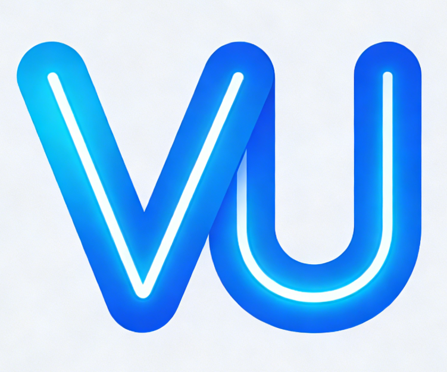

<div align="center">



# VU-Icons


Vue3 & UniApp SVG 图标组件库，支持 Tree Shaking 按需引入，内置完整 TypeScript 类型声明。

[English](./README.en-US.md) | [简体中文](./README.zh-CN.md)

</div>

## ✨ 特性

- 🎨 **双框架支持** - 同时支持 Vue3 和 UniApp
- 📦 **按需引入** - 支持 Tree Shaking 优化，只打包使用的图标
- 🎯 **内联 SVG** - 性能优异，无额外请求
- 🌈 **高度可定制** - 支持自定义尺寸和颜色
- 📝 **TypeScript** - 完整的类型声明，开发体验优秀
- 🚀 **自动化构建** - 一键生成组件，快速添加新图标
- 📱 **响应式设计** - 支持数字和字符串尺寸

## 📦 安装

```bash
npm install vu-icons
```

或使用 yarn：

```bash
yarn add vu-icons
```

## 🚀 快速开始

### Vue3 项目

```vue
<script setup lang="ts">
import { VuUser, VuSearch, VuStar } from 'vu-icons'
</script>

<template>
  <div>
    <VuUser :size="24" color="#333" />
    <VuSearch :size="32" color="#1890ff" />
    <VuStar :size="20" color="#faad14" />
  </div>
</template>
```

### UniApp 项目

```vue
<script setup lang="ts">
import { VuUser, VuSearch, VuStar } from 'vu-icons/uniapp'
</script>

<template>
  <view>
    <VuUser :size="24" color="#333" />
    <VuSearch :size="32" color="#1890ff" />
    <VuStar :size="20" color="#faad14" />
  </view>
</template>
```

## 📖 Props

| 属性 | 类型 | 默认值 | 说明 |
|------|------|---------|------|
| size | number \| string | 24 | 图标尺寸，支持数字（px）或字符串（如 '2rem'、'24px'） |
| color | string | 'currentColor' | 图标颜色，支持任何有效的 CSS 颜色值 |
| className | string | '' | 自定义类名 |
| spin | boolean | false | 是否旋转，适用于加载状态 |

## 🎨 使用示例

### 加载状态 / 旋转图标

```vue
<template>
  <div>
    <VuLoading :size="24" color="#1890ff" spin />
    <!-- 任何图标都可以旋转 -->
    <VuRefresh :size="24" spin />
  </div>
</template>
```

### 自定义尺寸

```vue
<template>
  <div>
    <VuUser :size="16" color="#333" />
    <VuUser :size="24" color="#333" />
    <VuUser :size="32" color="#333" />
    <VuUser :size="48" color="#333" />
  </div>
</template>
```

### 自定义颜色

```vue
<template>
  <div>
    <VuUser :size="32" color="#1890ff" />
    <VuUser :size="32" color="#52c41a" />
    <VuUser :size="32" color="#faad14" />
    <VuUser :size="32" color="#f5222d" />
  </div>
</template>
```

### 使用字符串尺寸

```vue
<template>
  <div>
    <VuUser size="1rem" color="#722ed1" />
    <VuUser size="2rem" color="#722ed1" />
    <VuUser size="3rem" color="#722ed1" />
  </div>
</template>
```

### 结合 CSS 类名

```vue
<template>
  <div>
    <VuUser :size="24" color="#333" className="icon-hover" />
  </div>
</template>

<style>
.icon-hover:hover {
  opacity: 0.7;
  cursor: pointer;
}
</style>
```

## 📋 可用图标

| 图标 | 组件名 | 说明 |
|------|---------|------|
| 👤 | VuUser | 用户 |
| 🔍 | VuSearch | 搜索 |
| ⭐ | VuStar | 星星 |
| 🏠 | VuHome | 首页 |
| ⚙️ | VuSettings | 设置 |
| 💬 | VuMessage | 消息 |
| ℹ️ | VuInfo | 信息 |
| ❌ | VuClose | 关闭 |
| ➕ | VuAdd | 添加 |
| ✏️ | VuEdit | 编辑 |
| ❤️ | VuFavorite | 收藏 |
| ⬅️ | VuArrowLeft | 左箭头 |
| ➡️ | VuArrowRight | 右箭头 |
| ⬆️ | VuArrowUp | 上箭头 |
| ⬇️ | VuArrowDown | 下箭头 |
| ✅ | VuCheck | 对勾 |
| 🗑️ | VuDelete | 删除 |
| ⬇️ | VuDownload | 下载 |
| ⬆️ | VuUpload | 上传 |
| 🔗 | VuShare | 分享 |
| 👍 | VuLike | 点赞 |
| 👎 | VuDislike | 踩 |
| 🔍 | VuFilter | 筛选 |
| 📊 | VuSort | 排序 |
| 🔄 | VuRefresh | 刷新 |
| 🔒 | VuLock | 锁定 |
| 🔓 | VuUnlock | 解锁 |
| 🔔 | VuBell | 通知 |
| 📷 | VuCamera | 相机 |
| 🖼️ | VuImage | 图片 |
| 🎥 | VuVideo | 视频 |
| 🎵 | VuMusic | 音乐 |
| 📄 | VuFile | 文件 |
| 📁 | VuFolder | 文件夹 |
| 🔗 | VuLink | 链接 |
| 📋 | VuCopy | 复制 |
| 📌 | VuPaste | 粘贴 |
| ✂️ | VuCut | 剪切 |
| ↩️ | VuUndo | 撤销 |
| ↪️ | VuRedo | 重做 |

更多图标请查看 [ICONS.md](./ICONS.md)

## 🛠️ 开发

### 添加新图标

1. **准备 SVG 文件**
   - 将 SVG 文件放入 `src/icons/` 目录
   - 文件名使用 `kebab-case` 命名（如 `home.svg`、`settings.svg`）
   - 确保 SVG 是 24x24 的 viewBox

2. **构建项目**
   ```bash
   npm run build
   ```

3. **使用新图标**
   ```vue
   <script setup>
   import { VuNewIcon } from 'vu-icons'
   </script>
   
   <template>
     <VuNewIcon :size="24" color="#333" />
   </template>
   ```

### 项目结构

```
vu-icons/
├── src/
│   ├── icons/              # 原始 SVG 图标
│   ├── components/         # 组件模板和生成的组件
│   ├── build-components.ts # 组件生成脚本
│   └── index.ts           # 入口文件
├── examples/              # 示例项目
├── scripts/              # 构建脚本
├── dist/                # 构建输出（发布到 npm）
├── gulpfile.js          # Gulp 构建配置
├── package.json         # 项目配置
└── README.md           # 项目文档
```

### 本地开发

```bash
# 安装依赖
npm install

# 构建项目
npm run build

# 检查发布准备
npm run publish:check
```

## 📝 更新日志

查看 [CHANGELOG.md](./CHANGELOG.md) 了解版本更新历史。

## 📄 许可证

[MIT](./LICENSE)

## 🤝 贡献

欢迎贡献！如果你有好的建议或发现了 bug，欢迎提交 Issue 或 Pull Request。

## 📚 相关文档

- [ICONS.md](./ICONS.md) - 完整图标列表和使用说明
- [CHANGELOG.md](./CHANGELOG.md) - 版本更新日志

## ❓ 常见问题

### Q: 为什么选择内联 SVG 而不是字体图标？

A: 内联 SVG 有以下优势：
- 性能更好，无额外 HTTP 请求
- 支持按需引入，减少包体积
- 更灵活的样式控制
- 更好的可访问性

### Q: 如何在 Vue 2 中使用？

A: 本组件库仅支持 Vue3。如果你需要 Vue2 版本，可以考虑使用其他图标库。

### Q: 可以自定义图标的样式吗？

A: 可以！通过 `className` 属性添加自定义类名，或直接修改组件的样式。

### Q: 支持哪些平台？

A: 支持 Vue3 和 UniApp，可以在 Web、小程序、App 等平台使用。

## 🌟 Star History

如果这个项目对你有帮助，请给个 Star 支持一下！

<div align="center">

Made with ❤️ by [Your Name](https://github.com/yourusername)

</div>
